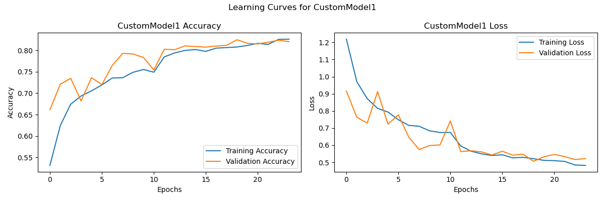
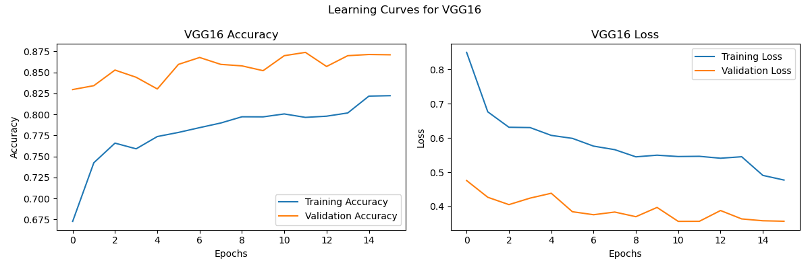

# Intel Image Classification with CNNs

**Dataset & Task:**  
The Intel Image Classification dataset consists of ~25,000 images (150x150 resolution) of natural scenes in 6 categories: **buildings**, **forest**, **glacier**, **mountain**, **sea**, and **street**. The task is to classify each image into the correct scene category.

This project explores both **custom Convolutional Neural Networks (CNNs)** and **pre-trained CNN models** (VGG16 and MobileNetV2) to compare their performance on this multi-class classification task.  
> ⚠️ **Note:** The dataset is not included in this repository. You can download it from [Kaggle](https://www.kaggle.com/datasets/puneet6060/intel-image-classification).

---

## 🔍 Approach

I trained **four models**:

- Two custom CNN models (CustomModel1 and CustomModel2)
- Two pre-trained models: VGG16 and MobileNetV2 (transfer learning with ImageNet weights)

Each model was evaluated under various hyperparameters: **learning rates**, **activation functions**, and **epoch counts**. We selected the best configuration for each model based on validation performance. Training logs and result plots are available in the `results/` directory.

---

## 📊 Results Summary

| Model         | Best Epochs | Best Val Accuracy | Best Train Accuracy | Best Val Loss | Test Accuracy | Test Loss |
|---------------|-------------|-------------------|----------------------|----------------|----------------|-----------|
| VGG16         | 16          | 0.8738            | 0.8223               | 0.3562         | 0.8620         | 0.3718    |
| MobileNetV2   | 21          | 0.9290            | 0.9690               | 0.2129         | 0.9273         | 0.2115    |
| CustomModel1  | 24          | 0.8245            | 0.8260               | 0.5062         | 0.8407         | 0.4689    |
| CustomModel2  | 25          | 0.8352            | 0.8272               | 0.4714         | 0.8323         | 0.4808    |

> _Best Epochs_: Based on early stopping criteria on validation loss.  
> _Accuracies_ are from final evaluation across training, validation, and test sets.

---

## 📈 Example Plots

  
*Training and validation accuracy/loss curves for Custom CNN 1.*

  
*Training and validation accuracy/loss curves for VGG16.*

More plots available in the `results/` directory.

---

## 🧠 Key Insights

- **MobileNetV2** had the highest validation and test accuracy due to efficient architecture and transfer learning.
- **VGG16** also performed well but not as well and efficient as MobileNetV2.
- **Custom CNNs** benefited from deeper layers and dropout, but plateaued near 80–81% accuracy.
- **ReLU** consistently outperformed other activation functions (like Sigmoid, Tanh, ELU) due to faster convergence.
- A **lower learning rate** (e.g., 0.001 for custom models, 0.0001 for pre-trained models) was crucial to prevent overshooting and overfitting.
